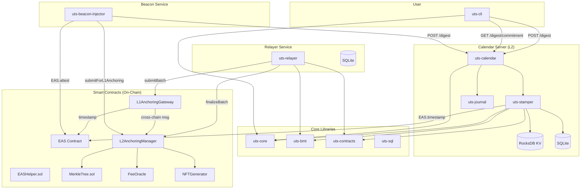
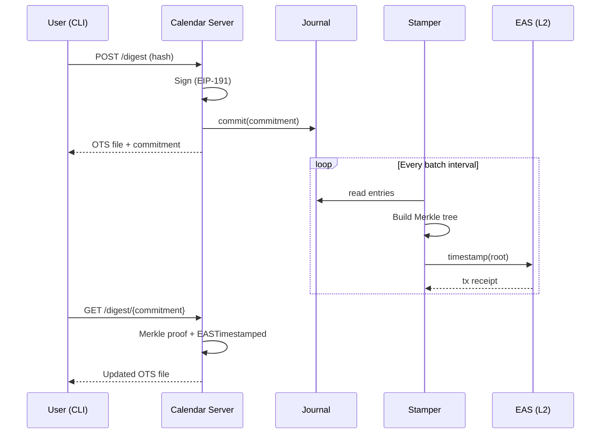
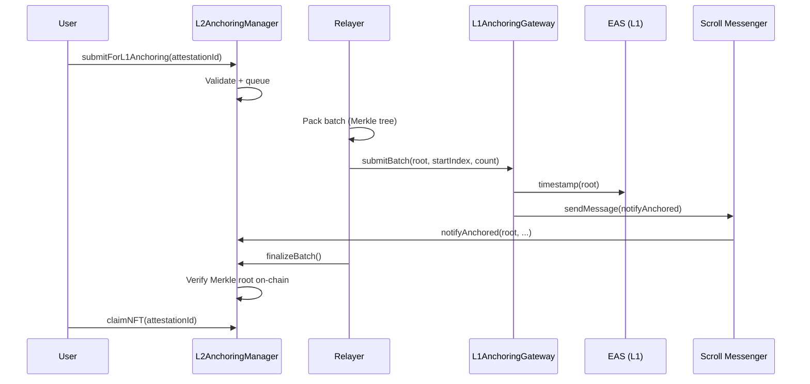
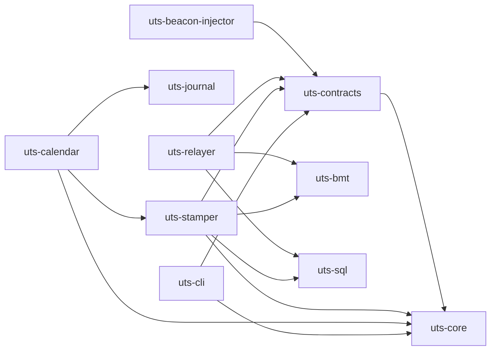

# System Architecture Overview

UTS is organized as a Rust workspace of 11 crates plus a set of Solidity smart contracts. This chapter provides a bird's-eye view of the system, its components, and the two main pipelines.

## Component Diagram

## Component Inventory

| Crate | Purpose |
|-------|---------|
| `uts-bmt` | Binary Merkle Tree — flat-array, power-of-two, proof generation |
| `uts-core` | OTS codec (opcodes, timestamps, attestations), verification logic |
| `uts-journal` | RocksDB-backed write-ahead log with at-least-once delivery |
| `uts-calendar` | HTTP calendar server — accepts digests, serves proofs |
| `uts-stamper` | Batching engine — builds Merkle trees, submits attestations |
| `uts-cli` | Command-line tool — stamp, verify, inspect, upgrade |
| `uts-contracts` | Rust bindings for EAS and L2AnchoringManager contracts |
| `uts-relayer` | L2→L1→L2 relay service with batch state machine |
| `uts-beacon-injector` | Injects drand beacon randomness into the timestamping pipeline |
| `uts-sql` | SQLite utilities and Alloy type wrappers |
| `uts-contracts-sdk` | Smart contract SDK |

## Two Pipelines

UTS operates two complementary pipelines:

### Pipeline A: Calendar Timestamping (L2 Direct)

The fast path. User digests are batched into a Merkle tree and the root is timestamped directly on L2 (Scroll) via EAS. This provides low-latency, low-cost timestamps.

### Pipeline B: L1 Anchoring (Cross-Chain)

The high-security path. L2 attestation roots are batched again and anchored on L1 Ethereum, providing L1-level finality guarantees. A relayer service orchestrates the cross-chain lifecycle.

## Crate Dependency Graph

## Beacon Injector

The beacon injector is an auxiliary service that injects [drand](https://drand.love/) randomness beacons into the timestamping pipeline. It submits beacon signatures to both the calendar server and the L1 anchoring pipeline, providing a continuous stream of publicly verifiable, unpredictable timestamps. See [Appendix A](./appendix-beacon.md) for details.
