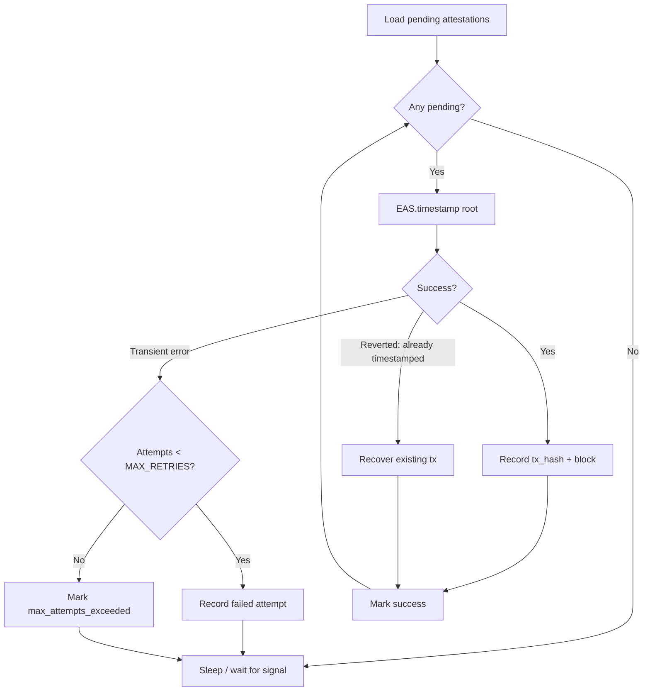

# On-Chain Attestation

The attestation phase takes pending Merkle roots and records them on-chain via the Ethereum Attestation Service (EAS). It is deliberately **decoupled** from tree creation to handle transient blockchain errors without blocking the batching pipeline.

## Decoupled Design

Tree creation and on-chain attestation run as separate tasks:

- The **stamper** builds trees and creates `pending_attestation` records in SQL.
- The **TxSender** watches for pending records and submits them to EAS.

This separation means that if the RPC endpoint is down or gas prices spike, the stamper continues batching. Pending attestations queue up in SQL and are retried when conditions improve.

## TxSender Work Loop

The `TxSender` wakes on three triggers:

1. **New batch signal** — the stamper notifies via a channel that a new pending attestation was created.
2. **Retry timeout** — 10 seconds after a failed attempt, the sender retries all pending attestations.
3. **Cancellation** — graceful shutdown.

```rust
pub struct TxSender<P: Provider> {
    eas: EAS<P>,
    sql_storage: SqlitePool,
    waker: Receiver<()>,
    token: CancellationToken,
}
```

## EAS.timestamp(root) Call

For each pending attestation, the sender calls the EAS `timestamp` function with the Merkle root:

```rust
let receipt = self.eas.timestamp(attestation.trie_root).send().await?;
```

On success, the transaction hash and block number are recorded in the `attest_attempts` table:

```sql
INSERT INTO attest_attempts (attestation_id, chain_id, tx_hash, block_number, created_at)
VALUES (?, ?, ?, ?, ?);
```

## Retry Logic

| Attempt | Outcome | Action |
|---------|---------|--------|
| 1–3 | Transient error | Retry after 10 seconds |
| > 3 | `MAX_RETRIES` exceeded | Mark as `max_attempts_exceeded` |
| Any | Success | Mark as `success` |

The maximum retry count is defined as:

```rust
const MAX_RETRIES: i64 = 3;
```

## Handling "Already Timestamped" Reverts

If the EAS contract reverts because the root was already timestamped (e.g., from a previous attempt that succeeded but whose receipt was lost), the TxSender recovers gracefully:

1. Call `EAS.getTimestamp(root)` to retrieve the existing timestamp.
2. Binary-search the block range to narrow down the transaction.
3. Query `Timestamped` event logs within the narrowed range.
4. Extract the original `tx_hash` and `block_number`.
5. Record the attempt as successful.

This ensures idempotent behavior — submitting the same root twice does not create duplicate on-chain entries and does not count as a failure.

## Transaction Flow


