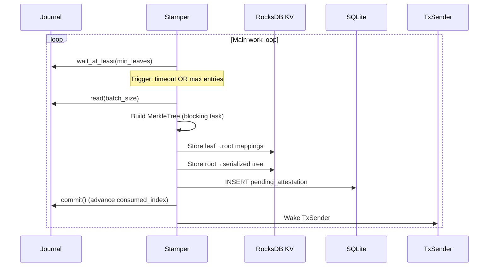

# Batching & Tree Creation

The stamper is the batching engine that reads commitments from the journal, groups them into a Merkle tree, and prepares batches for on-chain attestation.

## Stamper Work Loop



## Wait Strategy

The stamper triggers batching on whichever condition fires first:

| Trigger | Condition | Behavior |
|---------|-----------|----------|
| **Timeout** | `max_interval_seconds` elapsed (default: 10s) | Takes largest power-of-2 ≤ available entries |
| **Max entries** | `max_entries_per_timestamp` reached (default: 1024) | Takes exactly `max_entries_per_timestamp` entries |

If a timeout fires but fewer than `min_leaves` (default: 16) entries are available, the stamper takes all available entries to avoid creating excessively small trees.

## Power-of-Two Leaf Selection

The batch size is always a power of two (or all available entries if below `min_leaves`). This matches the Merkle tree's power-of-two padding requirement and minimizes wasted padding nodes.

For example, with 300 available entries, the stamper takes 256 (the largest power of two ≤ 300). The remaining 44 entries stay in the journal for the next batch.

## Tree Construction

Tree construction is CPU-intensive (hashing thousands of nodes), so it runs on a **blocking thread** to avoid starving the Tokio async runtime:

```rust
let tree = tokio::task::spawn_blocking(move || {
    let unhashed = MerkleTree::<Keccak256>::new_unhashed(&leaves);
    unhashed.finalize()
}).await?;
```

The two-phase construction (`new_unhashed` → `finalize`) separates allocation from computation, allowing the hashing to happen entirely on the blocking thread.

## KV Storage

After tree construction, two types of mappings are stored in RocksDB:

| Key | Value | Purpose |
|-----|-------|---------|
| `leaf` (32 bytes) | `root` (32 bytes) | Maps each commitment to its tree root |
| `root` (32 bytes) | Serialized tree (variable) | Stores the full tree for later proof generation |

For single-leaf trees (when only one entry is available), the leaf itself is the root, and the tree serialization is stored directly under the leaf key.

The `DbExt` trait on RocksDB provides the storage interface:

```rust
pub trait DbExt<D: Digest> {
    fn load_trie(&self, root: B256) -> Result<Option<MerkleTree<D>>>;
    fn get_root_for_leaf(&self, leaf: B256) -> Result<Option<B256>>;
}
```

## SQL: Pending Attestation

A record is inserted into SQLite to track the attestation lifecycle:

```sql
INSERT INTO pending_attestations (trie_root, created_at, updated_at, result)
VALUES (?, ?, ?, 'pending');
```

The `result` field transitions through: `pending` → `success` | `max_attempts_exceeded`.

## Journal Commit

After the tree and all storage writes succeed, the stamper calls `reader.commit()` to advance the journal's `consumed_index`. This deletes the consumed entries from RocksDB and frees capacity for new submissions.

The ordering is critical: storage writes happen **before** the journal commit. If the process crashes between tree creation and journal commit, the entries will be re-read and re-processed on restart (at-least-once semantics). Since Merkle trees are deterministic, re-processing produces identical results.

## Configuration

```rust
pub struct StamperConfig {
    pub max_interval_seconds: u64,        // Default: 10
    pub max_entries_per_timestamp: usize,  // Default: 1024 (must be power of 2)
    pub min_leaves: usize,                 // Default: 16
}
```
