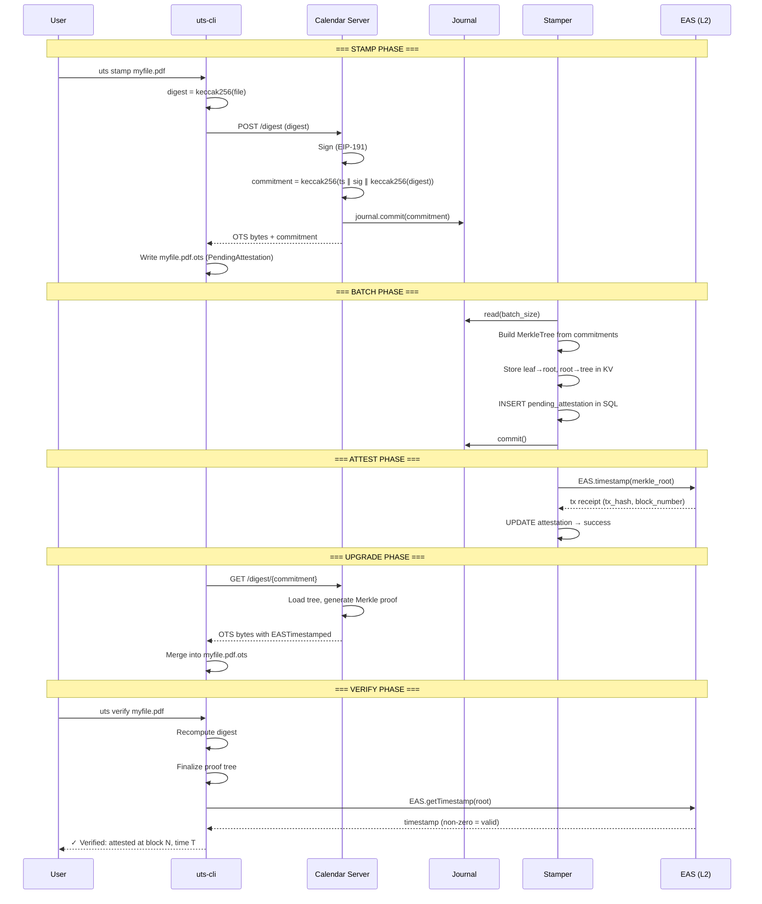

# Verification

Verification is the process of taking an `.ots` file and the original data, and confirming that the timestamp is valid and anchored on-chain.

## Verification Steps

### Step 1: Recompute the Digest

Hash the original file with the same algorithm specified in the OTS digest header:

```rust
let digest = hash_file::<Keccak256>(&file_contents);
assert_eq!(digest, ots_file.digest_header.digest());
```

If the digest doesn't match, the file has been modified since timestamping.

### Step 2: Finalize the Proof Tree

Walk the OTS timestamp tree, executing each opcode to compute intermediate values:

```rust
timestamp.finalize(&digest)?;
```

This propagates the original digest through PREPEND, APPEND, and KECCAK256 operations until reaching the attestation nodes. Each attestation's `value` field is set to the computed input at that point in the tree.

### Step 3: Verify On-Chain

For each `EASTimestamped` attestation in the tree:

1. Connect to the appropriate Ethereum RPC (auto-detected by chain ID from the attestation).
2. Call the EAS contract to verify the computed value was timestamped:

```rust
let verifier = EASVerifier::new(provider);
let result = verifier.verify(&attestation, &value).await?;
```

The verifier checks that `EAS.getTimestamp(value)` returns a non-zero timestamp, confirming the Merkle root was recorded on-chain.

### Step 4: Display Results

On success, the CLI displays:
- The chain where the attestation lives.
- The attestation UID.
- The attester address.
- The block time (when the root was timestamped).

## Full Pipeline Sequence



## Error Cases

| Error | Meaning |
|-------|---------|
| `NoValue` | Attestation node has no computed value (tree not finalized) |
| `Pending` | Attestation is still pending — poll the calendar server |
| `BadAttestationTag` | Unknown attestation type |
| `Decode` | Malformed attestation data |
| `EAS` | On-chain verification failed (root not found, wrong chain, etc.) |

## Verification Without the CLI

Since verification only requires:
1. The `.ots` file.
2. The original data.
3. Access to an Ethereum RPC.

Any implementation that can parse the OTS codec and execute the opcodes can independently verify a timestamp. There is no dependency on the calendar server for verification — the proof is fully self-contained.
