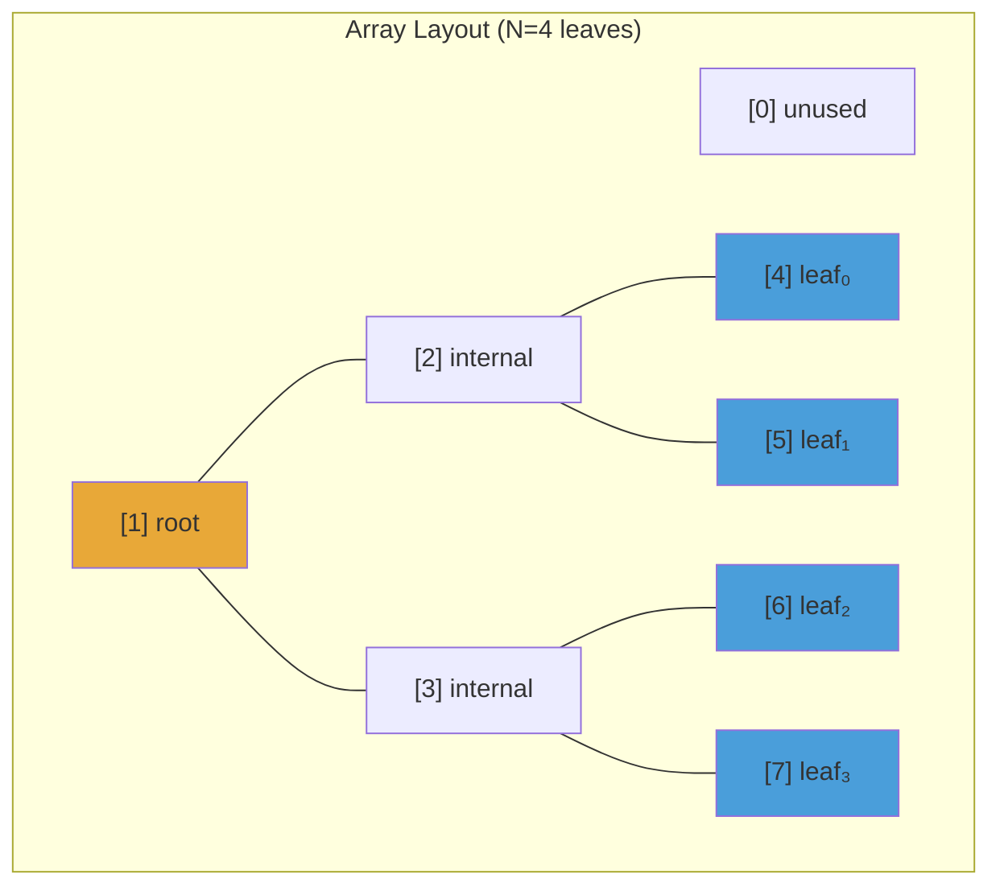
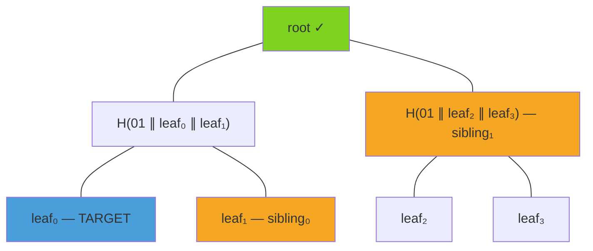

# Binary Merkle Tree

The binary Merkle tree (`uts-bmt`) is the fundamental data structure that enables UTS to batch thousands of timestamps into a single on-chain transaction. Each user's digest becomes a leaf, and only the 32-byte root is recorded on-chain.

## What is a Merkle Tree?

A Merkle tree is a binary tree of hashes. Each leaf node contains the hash of a data element, and each internal node contains the hash of its two children. The single hash at the top — the **root** — is a compact commitment to all the data below.

The key property: given a leaf and a short **proof** (the sibling hashes along the path to the root), anyone can verify that the leaf is included in the tree without knowing the other leaves.

## Flat Array Layout

UTS uses a **flat array** representation rather than pointer-based tree nodes. The array stores `2N` elements where `N` is the number of leaves (padded to the nearest power of two):

- Index `0` is unused (sentinel).
- Indices `[1, N)` store internal nodes (index `1` is the root).
- Indices `[N, 2N)` store leaf nodes.



Navigation is pure arithmetic:
- **Parent** of node `i`: `i >> 1` (right shift)
- **Sibling** of node `i`: `i ^ 1` (XOR with 1)
- **Children** of node `i`: `2i` (left) and `2i + 1` (right)

## Power-of-Two Sizing

Input data is always padded to the nearest power of two. If you have 5 leaves, the tree is built with 8 slots (3 padded with zero-hashes). This guarantees a perfect binary tree and simplifies indexing.

## Inner Node Prefix

To prevent **second-preimage attacks** (where an internal node could be confused with a leaf), internal nodes are hashed with a distinguishing prefix byte:

$$
\text{node}(i) = H(\mathtt{0x01} \;\|\; \text{left}(i) \;\|\; \text{right}(i))
$$

The constant `INNER_NODE_PREFIX = 0x01` is prepended before hashing children. Leaf nodes are stored as-is (they are already hashes of user data).

## Tree Construction

Construction happens in two phases:

1. **`new_unhashed`** — allocates the flat array and places leaves at their positions.
2. **`finalize`** — computes internal nodes bottom-up by hashing pairs of children.

```rust
// From crates/bmt/src/lib.rs
let tree = MerkleTree::<Keccak256>::new(&leaves);
let root = tree.root(); // &[u8; 32]
```

## Proof Generation

A Merkle proof is a sequence of sibling hashes from the leaf to the root. The `SiblingIter` walks up the tree using bitwise operations:



The proof for `leaf₀` consists of two entries:
1. `(Left, leaf₁)` — sibling is to the right, so append it.
2. `(Left, H(leaf₂ ∥ leaf₃))` — sibling is to the right, so append it.

Each entry is a `(NodePosition, &Hash)` pair where `NodePosition` indicates whether the target is the left or right child:
- **Left** → sibling is on the right → `H(0x01 ∥ target ∥ sibling)`
- **Right** → sibling is on the left → `H(0x01 ∥ sibling ∥ target)`

## Proof Verification

To verify a proof, start with the leaf hash and iteratively combine it with each sibling:

$$
v_0 = \text{leaf}
$$
$$
v_{i+1} = \begin{cases}
H(\mathtt{0x01} \;\|\; v_i \;\|\; s_i) & \text{if position}_i = \text{Left} \\
H(\mathtt{0x01} \;\|\; s_i \;\|\; v_i) & \text{if position}_i = \text{Right}
\end{cases}
$$

The proof is valid if and only if the final value equals the known root:

$$
v_n \stackrel{?}{=} \text{root}
$$

## Serialization

The tree supports zero-copy serialization via `as_raw_bytes()` and deserialization via `from_raw_bytes()`. The entire flat array is cast to/from a byte slice using `bytemuck`, enabling efficient storage in RocksDB without any encoding overhead.

## On-Chain Verification

The Solidity library `MerkleTree.sol` implements the same algorithm on-chain for the L1 anchoring pipeline. It uses identical constants (`INNER_NODE_PREFIX = 0x01`) and the same power-of-two padding strategy, ensuring that roots computed off-chain in Rust match roots verified on-chain in Solidity.

```solidity
// From contracts/core/MerkleTree.sol
function hashNode(bytes32 left, bytes32 right) public pure returns (bytes32) {
    // keccak256(0x01 || left || right)
    assembly {
        mstore(0x00, 0x01)
        mstore(0x01, left)
        mstore(0x21, right)
        result := keccak256(0x00, 0x41)
    }
}
```
