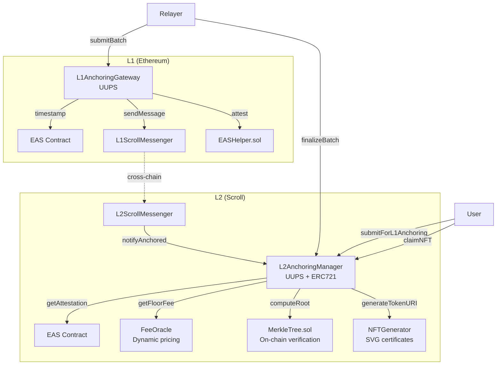

# Smart Contracts Architecture

The UTS L1 anchoring pipeline is implemented across four primary smart contracts that coordinate cross-chain timestamping between L2 (Scroll) and L1 (Ethereum mainnet).

## Contract Overview



## EASHelper

A library that wraps EAS attestation creation with UTS-specific parameters:

```solidity
bytes32 constant CONTENT_HASH_SCHEMA =
    0x5c5b8b295ff43c8e442be11d569e94a4cd5476f5e23df0f71bdd408df6b9649c;
```

All UTS attestations share:
- **Schema**: `CONTENT_HASH_SCHEMA` (un-revocable content hash)
- **Recipient**: `address(0)` (no specific recipient)
- **Revocable**: `false`
- **Expiration**: `0` (never expires)
- **Data**: `abi.encode(root)` (the Merkle root as a single `bytes32`)

## MerkleTree.sol

An on-chain implementation of the same binary Merkle tree algorithm used in the Rust `uts-bmt` crate. It ensures that roots computed off-chain match roots verified on-chain.

Key implementation details:

- Uses `INNER_NODE_PREFIX = 0x01` — identical to the Rust implementation.
- Pads leaves to power-of-two with `EMPTY_LEAF = bytes32(0)`.
- The `hashNode` function uses inline assembly for gas efficiency:

```solidity
function hashNode(bytes32 left, bytes32 right) public pure returns (bytes32 result) {
    assembly {
        mstore(0x00, 0x01)       // INNER_NODE_PREFIX
        mstore(0x01, left)       // 32 bytes
        mstore(0x21, right)      // 32 bytes
        result := keccak256(0x00, 0x41)  // Hash 65 bytes
    }
}
```

The `computeRoot` function reconstructs the full tree from an array of leaves:

1. Calculate `width = nextPowerOfTwo(count)`.
2. Hash leaf pairs into a buffer of `width/2` entries.
3. Handle odd leaves and padding.
4. Iteratively hash up the tree in-place until one root remains.

The `verify` function simply compares `computeRoot(leaves)` against an expected root.

## ERC-7201 Namespaced Storage

Both `L1AnchoringGateway` and `L2AnchoringManager` use ERC-7201 namespaced storage to avoid storage slot collisions in the upgradeable proxy pattern:

```solidity
// L1AnchoringGateway
bytes32 constant SLOT = keccak256(
    abi.encode(uint256(keccak256("uts.storage.L1AnchoringGateway")) - 1)
) & ~bytes32(uint256(0xff));

// L2AnchoringManager
bytes32 constant SLOT = keccak256(
    abi.encode(uint256(keccak256("uts.storage.L2AnchoringManager")) - 1)
) & ~bytes32(uint256(0xff));
```

This pattern stores all contract state in a deterministic, collision-free storage slot rather than in sequential slots starting from slot 0.

## Upgrade Pattern

Both gateway contracts use the UUPS (Universal Upgradeable Proxy Standard) pattern:
- The implementation contract contains the upgrade logic.
- Only the admin can authorize upgrades.
- A 3-day admin transfer delay prevents hasty privilege changes.
