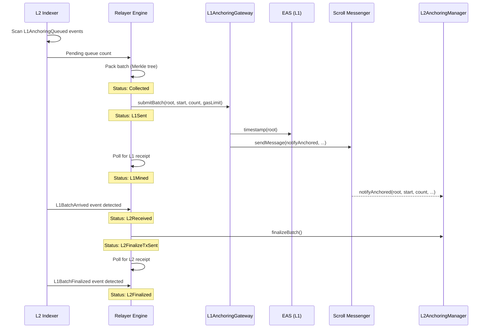
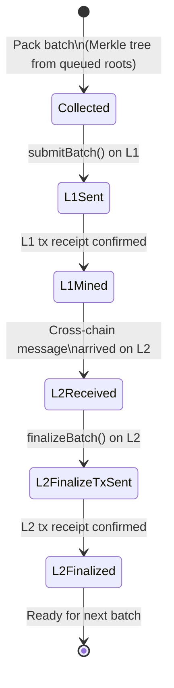

# Cross-Chain Relay

The relayer (`uts-relayer`) orchestrates the full L2→L1→L2 anchoring lifecycle. It monitors L2 events, packs batches, submits them to L1, and finalizes them back on L2.

## Architecture

The relayer consists of two main components:

1. **L2 Indexer** — scans and subscribes to on-chain events from the `L2AnchoringManager`.
2. **Batch Engine** — a state machine that drives batches through their lifecycle.

## L2 Indexer

The indexer tracks three event types from the L2AnchoringManager contract:

| Event | Purpose |
|-------|---------|
| `L1AnchoringQueued` | User submitted a root for L1 anchoring |
| `L1BatchArrived` | Cross-chain notification arrived from L1 |
| `L1BatchFinalized` | Batch verification and finalization completed |

For each event type, the indexer runs two parallel tasks:

- **Scanner**: historical catch-up via `eth_getLogs` with configurable batch size.
- **Subscriber**: real-time monitoring via WebSocket subscription.

The scanner rewinds by 100 blocks on startup for reorg protection:

```rust
const REWIND_BLOCKS: u64 = 100;
let start = last_indexed_block.saturating_sub(REWIND_BLOCKS);
```

Indexer progress is persisted in the `indexer_cursors` table, keyed by `(chain_id, event_signature_hash)`.

## Full Lifecycle Sequence



## Batch State Machine



### State Transitions

| From | To | Trigger | Action |
|------|----|---------|--------|
| (none) | Collected | Queue has enough items or timeout | `may_pack_new_batch()` |
| Collected | L1Sent | — | `send_attest_tx()`: call `L1AnchoringGateway.submitBatch()` |
| L1Sent | L1Mined | L1 tx receipt | `watch_l1_tx()`: validate `Timestamped` event, record gas fees |
| L1Mined | L2Received | `L1BatchArrived` event indexed | Wait for cross-chain message delivery |
| L2Received | L2FinalizeTxSent | — | `send_finalize_batch_tx()`: call `L2AnchoringManager.finalizeBatch()` |
| L2FinalizeTxSent | L2Finalized | L2 tx receipt | `watch_finalize_batch_tx()`: validate `L1BatchFinalized` event |

## Batch Packing Logic

The relayer packs a new batch when:

```
next_start_index = previous_batch.start_index + previous_batch.count
pending_count = count_pending_events(next_start_index)

Pack if:
  pending_count >= batch_max_size  OR
  (pending_count > 0  AND  elapsed >= batch_max_wait_seconds)
```

Batch packing constructs a `MerkleTree<Keccak256>` from the queued roots and stores the batch record:

```sql
INSERT INTO l1_batch (l2_chain_id, start_index, count, root, status)
VALUES (?, ?, ?, ?, 'Collected');
```

## Cost Tracking

The relayer records detailed cost breakdowns for each batch:

```sql
-- batch_fee table
INSERT INTO batch_fee (internal_batch_id, l1_gas_fee, l2_gas_fee, cross_chain_fee)
VALUES (?, ?, ?, ?);
```

- **L1 gas fee**: `gas_used × effective_gas_price` from the L1 receipt.
- **L2 gas fee**: `gas_used × effective_gas_price` from the L2 finalization receipt.
- **Cross-chain fee**: ETH value sent with the `submitBatch` call (pays for L1→L2 message delivery).

## Configuration

```rust
pub struct RelayerConfig {
    pub batch_max_size: i64,                   // Max items per batch (≤ 512)
    pub batch_max_wait_seconds: i64,           // Timeout before sealing
    pub tick_interval_seconds: u64,            // State machine poll frequency
    pub l1_batch_submission_gas_limit: u64,    // Gas limit for L1 tx
    pub l1_batch_submission_fee: U256,         // ETH value for cross-chain msg
}
```

## Database Schema

The relayer maintains its state in SQLite with these core tables:

| Table | Purpose |
|-------|---------|
| `indexer_cursors` | Track scanning progress per event type |
| `eth_block` | Block metadata for indexed events |
| `eth_transaction` | Transaction metadata |
| `eth_log` | Log metadata |
| `l1_anchoring_queued` | Queued anchoring requests (from L2 events) |
| `l1_batch` | Batch lifecycle state |
| `l1_batch_arrived` | Cross-chain arrival events |
| `l1_batch_finalized` | Finalization events |
| `tx_receipt` | Transaction execution details |
| `batch_fee` | Per-batch cost breakdown |
